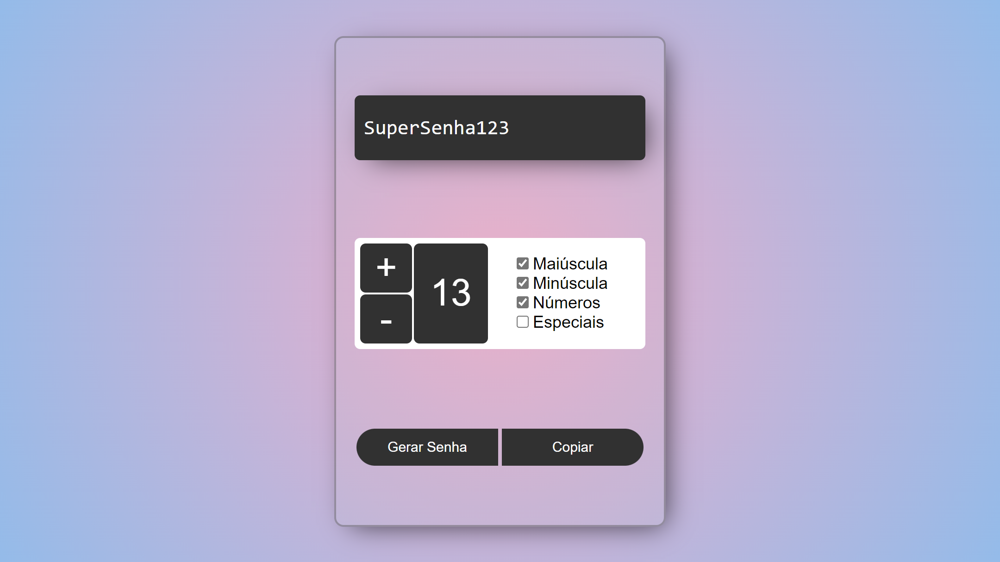

# GERADOR DE SENHAS

## REFERÊNCIAS

- [MDN - aria-hidden](https://developer.mozilla.org/en-US/docs/Web/Accessibility/ARIA/Attributes/aria-hidden)
- [Randomize ou Baralhe um Array em JavaScript](https://www.delftstack.com/pt/howto/javascript/shuffle-array-javascript/)
- [Efeito de Máquina de Escrever com JavaScript - Origamid](https://youtu.be/zx2axQoY_YM)
